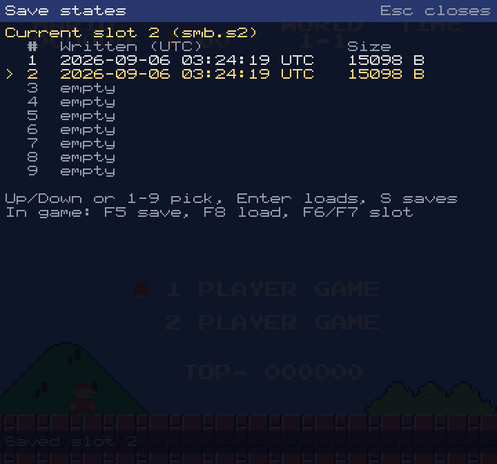
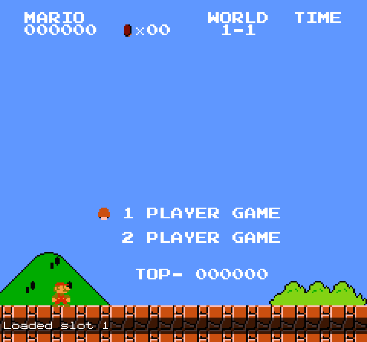

# Save States: Snapshot and Restore the Whole Machine

**Date:** 2026-09-06
**Type:** Feature / Persistence
**Status:** Complete (headless and scripted binary); feel of the keys needs a human
**Tracking:** GitHub issue #39

## Executive Summary

`System::save_state` writes every piece of emulation state to a byte
image and `System::load_state` restores it, so a game can be frozen at a
frame boundary and resumed later, bit for bit. The image is a hand-rolled
little-endian format in `src/state.rs` (no new crate: `Box<dyn Mapper>`
rules out derive-based serialisation anyway): a header with the ROM's
CRC-32, then tagged, length-prefixed sections that a reader can skip when
it does not know the tag. Every component writes its fields explicitly in
a documented order; nothing is derived, and a section that is not
consumed to its last byte on load is an error, so a field added to
`save` but not `load` (the classic save-state bug) fails loudly.

The SDL binary keeps nine slots next to the ROM as `<rom>.s1` .. `.s9`:
F5 saves, F8 loads, F6/F7 step the slot, the palette has `save state
[N]`, `load state [N]` and `slot N`, and a `states` page lists the slots
with their file times.

## Format

All integers are little-endian. Booleans are one byte, 0 or 1.
`Option<T>` is a presence byte followed by `T` (zero when absent).
Floats are the IEEE bit pattern (`to_le_bytes`), so a save after a load
reproduces the image exactly.

```text
offset  size  field
0       4     magic "NESS"
4       2     format version (u16), currently 1
6       4     ROM CRC-32 (u32): Cartridge::rom_crc32, the CRC of the image
              after the 16-byte iNES header
10      ...   sections, repeated to the end of the file:
                4  tag (ASCII, space padded)
                4  payload length (u32)
                n  payload
```

Sections written by `System::save_state`, in file order:

| Tag    | Contents |
|--------|----------|
| `CPU ` | CPU registers, cycle counters, DMA and interrupt sampling state, audio filter state |
| `RAM ` | 2 KB internal RAM |
| `PPU ` | Every PPU register, latch and pipeline field; OAM, nametables, palette |
| `APU ` | Every channel, the frame sequencer, the DMC reader, IRQ and mute flags |
| `MAPR` | The loaded mapper's registers, bank state, PRG RAM, CHR RAM, IRQ state |
| `INPT` | Both controllers |

All six must be present. Unknown tags are skipped (logged at debug
level) so the format can grow without a version bump; the version is
bumped only when an existing section changes layout. Not in the state:
the frame buffer (a state is taken between frames and the next frame
redraws it, provided the game has rendering enabled), the cheat set, and
the battery-save dirty hash (the next battery flush writes the restored
PRG RAM, which is intended).

### `CPU ` section (`System::save_cpu`)

| Field | Type | Notes |
|-------|------|-------|
| cpu_a, cpu_x, cpu_y, cpu_sp | u8 x 4 | |
| cpu_pc | u16 | |
| cpu_status | u8 | P register |
| total_cycles | u64 | CYC column; also the DMA get/put parity |
| instr_cycles | u16 | bus cycles ticked in the current instruction |
| dma_cycles | u16 | cycles DMA inserted into it |
| dmc_dma | bool, u64 attempt, Option u64 halted_at | outstanding DMC DMA request (docs/debugging/DMC_DMA.md) |
| padding_is_write | bool | RMW dummy-write padding flag |
| dmc_stall | u16, u16 | halt tick and stall length |
| nmi_pending | bool | latched NMI edge |
| nmi_seen_tick | u16 | |
| irq_hist | u16 | IRQ level per tick |
| poll_tick | u16 | branch sample-tick override |
| no_poll | bool | BRK / interrupt sequence |
| i_flag_for_poll | Option bool | CLI/SEI/PLP delayed I |
| sampled_nmi, sampled_irq | bool x 2 | snapshot consumed at the next boundary |
| mapper_irq | bool | test-driven IRQ line contribution |
| audio_sample_counter | f64 | fractional CPU cycles into the current 44.1 kHz sample |
| audio_hp | (f32, f32) x 2 | high-pass filter state |
| audio_acc | f32, u32 | box filter sum and count |

The per-instruction fields (`instr_cycles` through `i_flag_for_poll`)
are reset at the start of every `cpu_step`, so at a frame boundary they
are the previous instruction's leftovers; they are written anyway so the
image is the complete struct and the audit is mechanical. `audio_out`
(samples waiting for the caller) is not written: `load_state` clears it
and leaves `audio_capture` off, so the binary's audio-clocked frame loop
starts clean after a load.

### `PPU ` section (`impl Snapshot for Ppu`)

In order: `ctrl`, `mask`, `status` (u8 bit images), `oam_addr`,
`oam_data` (256), `ppu_data_buffer`, `nametable_ram` (4096), `palette`
(32), `scanline` u16, `cycle` u16, `frame` u64, `a12_last` bool,
`a12_low_cycles` u16, `io_bus` u8, `io_bus_stamp` (8 x u64),
`nmi_interrupt`, `nmi_line`, `suppress_vbl` (bools), `v` u16, `t` u16,
`x` u8, `w` bool, the four background shift registers (u16), the four
next-tile latches (u8), `secondary_oam` (32), `oam_copy_buffer`,
`eval_n`, `eval_m`, `eval_sec_addr`, `eval_in_range`, `eval_done`,
`eval_overflow_reads`, `eval_first`, `sprite_zero_next`, `sprite_count`,
`sprite_zero_in_units`, `sprite_patterns` (8 x (u8, u8)),
`sprite_positions` (8), `sprite_attributes` (8).

### `APU ` section (`impl Snapshot for Apu`)

Pulse 1, pulse 2, triangle, noise and DMC in turn, each writing its own
fields in declaration order (the shared `LengthCounter` writes `enabled`,
`counter`, `halt`, `pending_halt` Option bool, `pending_reload` Option
u8, `counter_at_write`), then `status` u8, `frame_counter` u8,
`frame_5step` bool, `frame_cycle` u32, `frame_reset_delay` u8,
`frame_interrupt`, `frame_interrupt_inhibit`, `cycles` u64, and the five
`channel_muted` flags. The per-channel mute flags are included because
they are `Apu` state that the mixer reads; the master mute is a binary
setting and is not.

### `MAPR` section (`Mapper::save_state`)

The payload is whatever the loaded board writes. Each mapper file
documents its order in a comment above `save_state`; all of them end
with the 8 KB PRG RAM and then the CHR image: a `bool` RAM flag followed,
for CHR RAM boards only, by a length-prefixed blob of the RAM (CHR ROM is
never written; it comes from the cartridge). On load the RAM flag and the
blob length must match the loaded cartridge.

| Mapper | Fields before PRG RAM and CHR |
|--------|-------------------------------|
| 0 NROM | mirroring u8 |
| 1 MMC1 | shift_register, shift_count, control, chr_bank_0, chr_bank_1, prg_bank (u8 each) |
| 2 UxROM | mirroring u8, prg_bank u8 |
| 3 CNROM | mirroring u8, chr_bank u8 |
| 4 MMC3 | bank_select, bank_data x 8, prg_ram_enabled, prg_ram_write_protect, four_screen, mirroring, irq_enabled, irq_counter, irq_latch, irq_reload, irq_pending, then the resolved prg_banks (4 x u32) and chr_banks (8 x u32) |
| 5 MMC5 | exram 1 KB, exram_mode, prg_mode, prg_banks x 5, prg_ram_protect x 2, chr_mode, chr_banks 12 x u16, upper_chr_bank_bits, nametable_mapping x 4, fill mode, vertical split registers, IRQ registers and counter, ppu_is_rendering, multiplier operands |
| 65 H3001 | mirroring u8, prg_banks x 3, chr_banks x 8 |
| 227 | latch u16 |

`Mapper` gained `save_state(&self, &mut Writer)` and
`load_state(&mut self, &mut Reader) -> Result<(), StateError>` with
defaults that write nothing and, on load, log a warning and restore
nothing; every shipped mapper overrides both.

### `INPT` section

Controller 1 then controller 2, each `buttons` u8 (bit image), `strobe`
bool, `index` u8. The buttons are in the state because the shift register
reads them; after a load a key that is physically held will disagree with
the restored buttons until it is released.

## API

```rust
pub fn System::save_state(&self) -> Vec<u8>
pub fn System::load_state(&mut self, data: &[u8]) -> Result<(), StateError>
```

`load_state` validates the magic, version, CRC and every section header
(`state::parse`) and checks that all six required sections are present
before it touches anything, so a truncated file, a bad magic, a state for
another ROM or a missing section leaves the machine exactly as it was.
Sections are then applied in file order and each known one must be
consumed to its last byte (`Reader::finish`). A layout error inside a
section can only come from a file written by an incompatible build; it is
reported after the sections before it were applied, so reset or load
another state.

Both are meant to run between frames, after `run_frame` returns; the
frame buffer is not part of the image.

## Binary

| Key | Action |
|-----|--------|
| F5 | Save to the current slot |
| F8 | Load the current slot |
| F6 / F7 | Previous / next slot (wraps 1..9), shows whether it is saved |

Every action prints a line at the bottom of the picture for two seconds
(`Saved slot 2`, `Loaded slot 2`, `Slot 3 (empty)`, `Load failed: save
state is for a different ROM ...`). The line is drawn by `main` from
`App::osd_message`, independently of the volume indicator, in every UI
mode.

Palette commands: `save state` and `load state` take an optional slot
number (`save state 4`), defaulting to the current slot; `slot N` makes
N current; a bare `slot` opens the page; `states` opens the page.

The **States** page (`src/ui/tools/states.rs`) lists the nine slots with
the file's modification time (UTC, formatted with a stdlib days-to-civil
routine rather than a time-zone crate) and size, marks the current slot
with `>`, and highlights the cursor. Up/Down or 1-9 move the cursor,
Return loads the highlighted slot, S saves to it; both make it the
current slot. The list is re-read from disk on every draw. Escape or Q
close.





A load while paused sets `frame_advance` so one frame runs and the
picture shows the restored state instead of the stale buffer.

The screenshots were made from a scratch copy of Super Mario Bros. (so
the `.s1`/`.s2` files did not land in `roms/`) with:

```sh
./target/debug/nes-emu smb.nes --no-audio \
  --ui-script "<90 empty entries>,F5,F7,F5,,,backquote,s,t,a,t,e,s,Return,,,,,Down,Down,,,,Escape,F6,,F8,,,Escape" \
  --screenshot states-osd.ppm:124 --screenshot states.ppm:135 \
  --screenshot states-cursor.ppm:140 --screenshot states-loaded.ppm:146
```

## Audit method

The rule is "every field of every struct that affects emulation is
written and read by hand, in declaration order, with the order written
down next to the code". The audit was done struct by struct against the
field lists in `src/system.rs`, `src/ppu/mod.rs`, `src/apu/mod.rs`,
`src/input/mod.rs` and each `src/cartridge/mapperN.rs`, and is enforced
three ways:

1. **Save, load, save.** After a busy run the image is saved, loaded into
   the same machine, and saved again; the two images must be identical.
   A field written by `save` and not restored by `load` produces a
   different second image (unless it happens to hold its power-on value,
   which is why the runs are busy: audio capture on, a DMC sample in
   flight, an MMC3 IRQ counter armed).
2. **`Reader::finish`.** Each known section must be consumed exactly. A
   field written and not read (or the reverse) shifts everything after
   it and leaves bytes over or runs out early.
3. **Determinism.** Run on after the save and hash the frame buffer at
   checkpoints, load, run the same span again: the hashes must match,
   and so must the complete state image at the end of both runs, which
   is stronger than the picture because it covers state that has not
   reached the screen yet.

When adding a field to any of these structs, add it to `save` and `load`
and the comment above them; test 2 will catch a miss in one of the two,
test 1 a miss in both if the field ever moves during the test's run.

## Verification

Headless (`cargo test`, debug):

- `src/state.rs`: scalar encoding, section framing, bad magic, bad
  version, every truncation point, an overrunning length field,
  `finish` on unread bytes.
- `src/input/mod.rs`, `src/ppu/mod.rs`, `src/apu/mod.rs`: per-component
  round trips with every field set to a distinct value (PPU), a fully
  programmed APU stepped 5000 cycles then compared cycle by cycle for
  20000 more against the restored copy, a controller mid-read.
- `src/cartridge/mapper*.rs`: each mapper switches banks (MMC1 with two
  bits of a serial write in flight, MMC3 with the IRQ counter half way
  down, MMC5 with ExRAM and the multiplier written), saves, switches
  again, loads, and reads match the first state; the re-save matches
  the image.
- `tests/save_states.rs`: full-machine round trips on committed test
  ROMs chosen for live awkward state (`mmc3_test_2` 4-scanline_timing,
  `apu_test` 7-dmc_basics, `sprdma_and_dmc_dma`, `ppu_vbl_nmi`
  06-suppression), save/load/save identity, wrong-ROM CRC refused,
  truncation refused without touching the machine, no cartridge
  refused, unknown sections skipped, missing section refused, a short
  section reported as truncated and a long one as a layout error.
- nestest and every blargg suite unchanged (`cargo test`: 82 blargg
  tests pass, 1 ignored as before).

Ignored (`cargo test --release --test save_states -- --ignored --nocapture`,
needs `roms/mario.nes`):

```text
state image: 15098 bytes
frame +100: 3f06e2050489c188 3f06e2050489c188
frame +200: 666f596e35a02a29 666f596e35a02a29
frame +300: 2262c56144cdf22b 2262c56144cdf22b
test super_mario_bros_round_trip_is_bit_exact ... ok
```

400 frames with Start tapped at 150 and Right held from the save, 300
more frames hashed at 100/200/300, load, the same 300 frames: identical,
and the re-save equals the image.

Scripted binary: the `--ui-script` run above saved slots 1 and 2, opened
the page, moved the cursor, stepped back to slot 1 with F6 and loaded it
with F8; the log shows `Saved slot 1`, `Slot 2 (empty)`, `Saved slot 2`,
`Slot 1 (saved)`, `Loaded slot 1` and the screenshots show the page and
both OSD lines.

## Needs a human

- F5-F8 on a real keyboard (macOS may map F-keys to media functions
  unless Fn is held or the system setting is changed).
- Whether a held direction across a load feels right: the restored
  controller image wins until the key is released.
- The two-second OSD line at the bottom of the picture: position, size.

## Debugging notes

- The first cut of the round-trip test asserted that the frame hashes at
  the checkpoints differed from each other; blargg ROMs show a static
  text screen while they run, so that failed although the round trip
  was exact. The test now asserts that the state image moved on
  (differs from the snapshot) and that both runs end in the same image.
- `state::parse` accepts a bare header with no sections; the truncation
  test had to skip that prefix length.
- `LengthCounter` already had a `load(index)` method, so the APU
  channel helpers are `save_state`/`load_state` and only `Apu` itself
  implements the `Snapshot` trait.
- The first States-page screenshot was taken on the same frame as a
  scripted Down, so the cursor had already moved; screenshots that
  should show the page as opened must land on an empty script entry.
